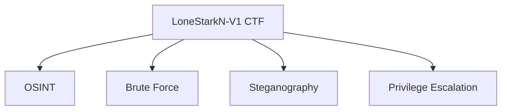

# LoneStarkN-V1 CTF  
*An Immersive Beginner Cybersecurity Challenge*  

## 🌟 Project Overview  
**Developed:** June 2023 | **Published:** [June 25/2023]  
**Author:** Ajay Kumar  
**Target Audience:** Cybersecurity beginners & enthusiasts  

Originally created for hands-on penetration testing practice and later submitted to **Vulnweb** and **TryHackMe**, this CTF is now publicly available to help aspiring security professionals develop essential skills through practical challenges.  

---

---

## 🔥 Key Learning Objectives  
This CTF is designed to teach foundational techniques through realistic scenarios:  

| Category              | Skills Demonstrated                          | Tools/Techniques                     |
|-----------------------|---------------------------------------------|--------------------------------------|
| **Brute Forcing**     | Password cracking, credential harvesting    | Hydra, John the Ripper, wordlists    |
| **Steganography**     | Data hiding & extraction from files         | steghide, binwalk, EXIF tools        |
| **OSINT**            | Open-source intelligence gathering          | Metadata analysis, social profiling  |
| **Privilege Escalation** | System privilege exploitation            | Linux sudo misconfigs, Windows token manipulation |

---

## 🛠️ CTF Contents  
The challenge package includes:  
- `LoneStarkN-V1.ova`: Pre-configured virtual machine (VM) for testing   
- `ScreenShots`: Proff ScreenShots 

> 📌 **Note:** Solutions are intentionally omitted to preserve the learning experience. Contact me directly for verified solve paths.

---

## 🚀 Getting Started  
### Method 1: Virtual Machine  
1. Download the [.ova file](https://drive.google.com/file/d/1qmSTWjXgdth26Euc7TPKNIfBTSo9tKri/view)  
2. Import into VirtualBox/VMWare  
3. Network settings: **Host-Only or NAT**  

### Method 2: Standalone Challenges  
Extract individual components from the VM:  
- Web apps for brute forcing  
- Image files for steganography  
- Fake social profiles for OSINT  

---

## 📜 Certification & Validation  
This CTF has been:  
✅ Accepted by **Vulnweb** for training purposes ([Proof](Screenshots/vulnweb_confirmation.png))  
✅ Deployed on **TryHackMe** for public testing ([Proof](Screenshots/thm_submission.png))  

---

## 💼 Professional Value  
### Why This Matters for Your Career  
- **Demonstrates Technical Skills:** Real-world applicable techniques  
- **Teaching Ability:** Designed with beginner-friendly hints  
- **Community Impact:** Used by platforms like TryHackMe  

---

## 📬 Contact & Contribution  
Found issues or want to expand this project?  
- Email: [Your Professional Email]  
- LinkedIn: [Your Profile Link]  

  
